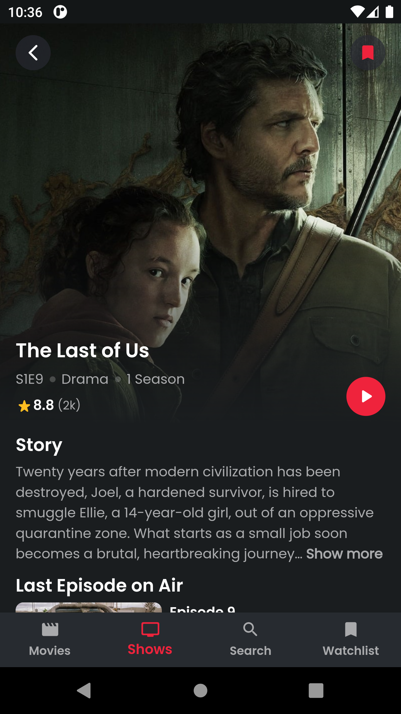

<div align="center">
  
  <h1>🎬 Munir Movies</h1>
  <p><strong>Discover. Watch. Enjoy.</strong></p>
  
  <p>
    <a href="https://flutter.dev/"></a>
    <a href="https://dart.dev/"></a>
    <a href="https://opensource.org/licenses/MIT"></a>
    
  </p>

  <p><em>A modern, feature-rich Flutter application for discovering movies and TV shows with beautiful UI, powerful search, and seamless user experience.</em></p>

  <p>
    <a href="#features">Features</a> •
    <a href="#screenshots">Screenshots</a> •
    <a href="#architecture">Architecture</a> •
    <a href="#installation">Installation</a> •
    <a href="#contributing">Contributing</a>
  </p>
</div>

---

## ✨ Features

### 🔍 **Discovery & Search**
- **Global Search**: Lightning-fast search across movies and TV shows
- **Smart Filtering**: Multiple categories and sorting options
- **Real-time Results**: Instant search suggestions and results

### 🎭 **Content Exploration**
- **Movies Hub**: Now Playing, Popular, and Top Rated collections
- **TV Shows Center**: On Air, Popular, and Top Rated series
- **Detailed Pages**: Rich media information with trailers, cast, reviews
- **Season Explorer**: Episode breakdowns and season details
- **Similar Content**: Discover related movies and shows

### 💾 **Personal Experience**
- **Smart Watchlist**: Save favorites with offline persistence
- **Viewing History**: Track your watching journey
- **Custom Collections**: Organize content your way
- **Cross-Platform Sync**: Seamless experience across devices

### 🎨 **User Interface**
- **Modern Design**: Clean, intuitive Material Design UI
- **Smooth Animations**: Fluid transitions and micro-interactions
- **Responsive Layout**: Perfect on phones, tablets, and web
- **Dark/Light Theme**: Adaptive theming for comfort
- **Image Optimization**: Fast loading with smart caching

---

## 📱 Screenshots

<div align="center">
  
  
  
  
  
</div>

---

## 🏗️ Architecture

Built with **Clean Architecture** principles for maintainability, testability, and scalability.

```
🏛️ Presentation Layer
├── 🎨 UI Widgets (Screens, Components)
├── 🧠 BLoC State Management
└── 🎯 Dependency Injection

💼 Domain Layer
├── 📋 Entities (Business Objects)
├── 📖 Use Cases (Business Logic)
└── 🔌 Repository Interfaces

🗄️ Data Layer
├── 🌐 Remote Data Sources (API)
├── 💾 Local Data Sources (Hive)
├── 🔄 Repository Implementations
└── 📝 Data Models
```

### Key Architectural Decisions

- **🧠 BLoC Pattern**: Predictable state management with clear separation of concerns
- **💉 Dependency Injection**: Clean dependencies with GetIt service locator
- **🛣️ Declarative Routing**: Type-safe navigation with GoRouter
- **🔄 Repository Pattern**: Unified data access with caching strategies
- **📦 Feature-based Structure**: Modular organization for scalability

---

## 🛠️ Tech Stack

### **Core Technologies**
- **Flutter 3.0+** - Cross-platform UI framework
- **Dart 3.0+** - Programming language

### **State Management & Architecture**
- **flutter_bloc** - Predictable state management
- **get_it** - Service locator for dependency injection
- **dartz** - Functional programming utilities
- **equatable** - Value equality for objects

### **Networking & Data**
- **dio** - HTTP client with interceptors
- **hive** - Lightweight NoSQL database
- **hive_flutter** - Flutter integration for Hive

### **UI & UX**
- **go_router** - Declarative routing solution
- **cached_network_image** - Optimized image loading
- **carousel_slider** - Interactive content carousels
- **shimmer** - Loading state animations
- **google_fonts** - Beautiful typography
- **flutter_rating_bar** - Interactive rating widgets
- **readmore** - Expandable text widgets

### **Development Tools**
- **build_runner** - Code generation
- **hive_generator** - Model code generation
- **flutter_lints** - Dart linting rules

---

## 🚀 Installation

### Prerequisites
- Flutter SDK 3.0 or higher
- Dart SDK 3.0 or higher
- Android Studio / VS Code
- Git

### Quick Start

1. **Clone the repository**
   ```bash
   git clone https://github.com/munir011/munir-movies.git
   cd movie_app
   ```

2. **Install dependencies**
   ```bash
   flutter pub get
   ```

3. **Configure TMDB API**
   - Get your free API key from [TMDB](https://www.themoviedb.org/settings/api)
   - Update `lib/core/data/network/api_constants.dart`:
   ```dart path=lib/core/data/network/api_constants.dart start=4
   static const String apiKey = 'YOUR_TMDB_API_KEY_HERE';
   ```

4. **Run the app**
   ```bash
   # For web (fastest for development)
   flutter run -d chrome
   
   # For iOS simulator
   flutter run -d ios
   
   # For Android emulator
   flutter run -d android
   ```

### Platform-Specific Setup

<details>
<summary><strong>📱 iOS Setup</strong></summary>

1. Open `ios/Runner.xcworkspace` in Xcode
2. Select your development team
3. Update bundle identifier if needed
4. Run from Xcode or use:
   ```bash
   flutter run -d ios
   ```
</details>

<details>
<summary><strong>🤖 Android Setup</strong></summary>

1. Ensure Android SDK is installed
2. Accept Android licenses:
   ```bash
   flutter doctor --android-licenses
   ```
3. Run the app:
   ```bash
   flutter run -d android
   ```
</details>

<details>
<summary><strong>🌐 Web Setup</strong></summary>

1. Enable web support:
   ```bash
   flutter config --enable-web
   ```
2. Run on web:
   ```bash
   flutter run -d chrome
   ```
</details>

---

## 📂 Project Structure

```
lib/
├── 🚀 main.dart                    # App entry point
├── 🏛️ core/                       # Shared/Core functionality
│   ├── 🗄️ data/
│   │   ├── 🌐 network/             # API configuration
│   │   └── ❌ error/               # Error handling
│   ├── 💼 domain/
│   │   ├── 📋 entities/            # Core business objects
│   │   └── 📖 usecase/             # Base use case
│   ├── 🎨 presentation/
│   │   └── 🧱 components/          # Shared UI components
│   ├── 📚 resources/               # App constants, themes, strings
│   └── 🛠️ services/               # Dependency injection
├── 🎬 movies/                      # Movies feature module
│   ├── 🗄️ data/
│   │   ├── 📊 datasource/          # Remote & local data sources
│   │   ├── 📝 models/              # Data models
│   │   └── 🔄 repository/          # Repository implementation
│   ├── 💼 domain/
│   │   ├── 📋 entities/            # Movie entities
│   │   ├── 🔌 repository/          # Repository interface
│   │   └── 📖 usecases/            # Movie use cases
│   └── 🎨 presentation/
│       ├── 🧠 bloc/                # State management
│       ├── 📱 screens/             # Movie screens
│       └── 🧱 components/          # Movie-specific components
├── 📺 tv_shows/                    # TV Shows feature module
│   └── [Similar structure to movies]
├── 📋 watchlist/                   # Watchlist feature module
│   └── [Similar structure to movies]
└── 🔧 utils/                       # Utility functions
```

---

## 🧪 Key Features Deep Dive

### 🎯 **Smart Search System**
- Multi-category search (Movies, TV Shows, People)
- Debounced input for performance
- Search history and suggestions
- Real-time filtering and sorting

### 📊 **Data Management**
- Efficient caching with Hive database
- Automatic data synchronization
- Offline-first approach for watchlist
- Pagination for large datasets

### 🎨 **UI/UX Excellence**
- Consistent Material Design implementation
- Smooth page transitions and animations
- Responsive design for all screen sizes
- Accessibility support

### ⚡ **Performance Optimizations**
- Image lazy loading and caching
- Memory-efficient list rendering
- Background data prefetching
- Optimized build configurations

---

## 🛠️ Development

### Code Generation
```bash
# Generate Hive adapters and other code
flutter packages pub run build_runner build --delete-conflicting-outputs
```

### Testing
```bash
# Run all tests
flutter test

# Run tests with coverage
flutter test --coverage
```

### Building
```bash
# Build APK
flutter build apk --release

# Build iOS
flutter build ios --release

# Build Web
flutter build web --release
```

---

## 🤝 Contributing

Contributions are welcome! Here's how you can help:

1. **Fork the repository**
2. **Create a feature branch**: `git checkout -b feature/amazing-feature`
3. **Commit your changes**: `git commit -m 'Add amazing feature'`
4. **Push to the branch**: `git push origin feature/amazing-feature`
5. **Open a Pull Request**

### Contribution Guidelines
- Follow the existing code style and architecture
- Add tests for new features
- Update documentation when necessary
- Ensure all tests pass before submitting

---

## 📄 License

This project is licensed under the MIT License - see the [LICENSE](LICENSE) file for details.

---

## 🙏 Acknowledgments

- **[The Movie Database (TMDB)](https://www.themoviedb.org/)** - Comprehensive movie and TV data API
- **Flutter Team** - Amazing cross-platform framework
- **Open Source Community** - Fantastic packages and inspiration

---

## 📞 Contact & Support

<div align="center">
  <p><strong>Built with ❤️ by Munir</strong></p>
  
  <p>
    <a href="https://github.com/munir011">🐙 GitHub</a> •
    <a href="https://linkedin.com/in/munir011">💼 LinkedIn</a> •
    <a href="mailto:your.email@example.com">📧 Email</a>
  </p>
  
  <p><em>If you found this project helpful, please give it a ⭐!</em></p>
</div>

---

<div align="center">
  <sub>This product uses the TMDB API but is not endorsed or certified by TMDB.</sub>
</div>
