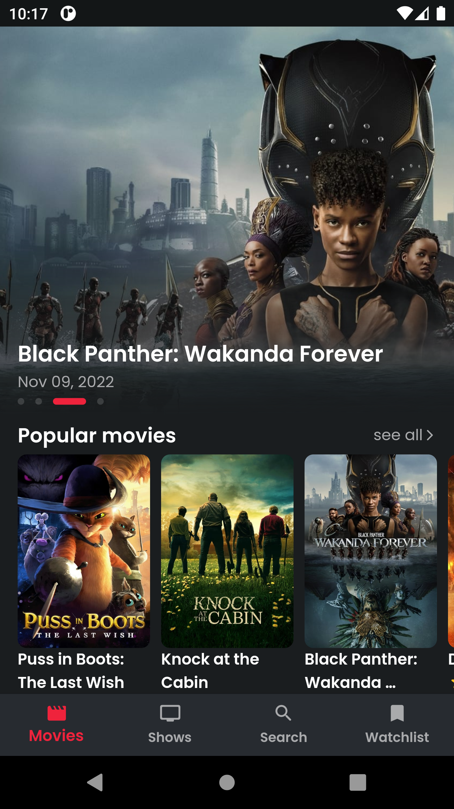
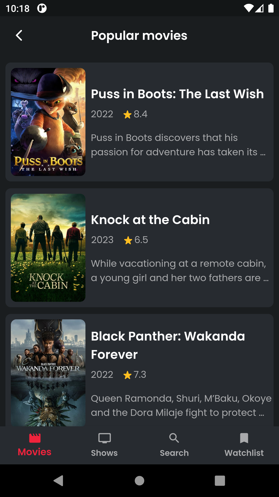
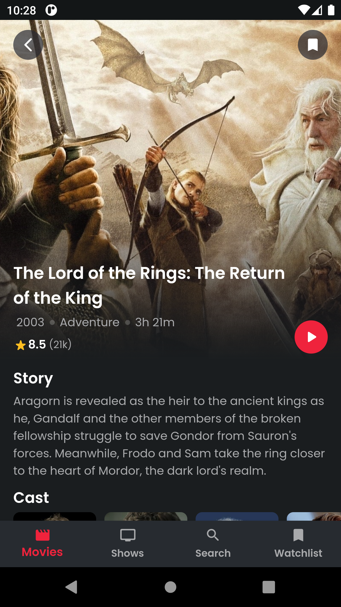
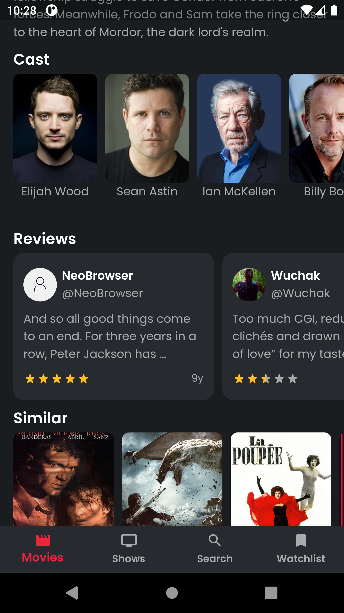

<div align="center">
  
  <h1>🎬 Munir Movies</h1>
  
  <p>
    <a href="https://flutter.dev/"></a>
    <a href="https://dart.dev/"></a>
    
  </p>

  <p>A modern Flutter app for discovering movies and TV shows with clean architecture and beautiful UI.</p>

  <p>
    <a href="https://youtu.be/JlsN8xb195A" target="_blank">
      
    </a>
  </p>
</div>

## 📺 Demo Video

<div align="center">
  <a href="https://youtu.be/JlsN8xb195A" target="_blank">
    
  </a>
  <p><em>Click the image above to watch the full demo on YouTube</em></p>
</div>

- **🎨 Modern UI** - Clean Material Design with smooth animations

## 📱 Screenshots

<div align="center">
  
  
  
  
</div>

## 🏗️ Architecture

Built with **Clean Architecture** and modern Flutter patterns:

- **🧠 BLoC** - State management
- **💉 GetIt** - Dependency injection
- **🛣️ GoRouter** - Navigation
- **🔄 Repository Pattern** - Data layer
- **💾 Hive** - Local storage

## 🛠️ Tech Stack

**Core:** Flutter 3.0+, Dart 3.0+  
**State Management:** BLoC, GetIt  
**Data:** Dio (API), Hive (Local Storage)  
**UI:** Material Design, Cached Images, Animations  
**Architecture:** Clean Architecture, Repository Pattern

## 🚀 Quick Start

```bash
# Clone and setup
git clone https://github.com/black12-ag/movies-app.git
cd movies-app
flutter pub get

# Add your TMDB API key to lib/core/data/network/api_constants.dart
# Get free API key from: https://www.themoviedb.org/settings/api

# Run the app
flutter run -d chrome  # Web
flutter run -d ios     # iOS
flutter run -d android # Android
```

## 🛠️ Development

```bash
# Code generation
flutter packages pub run build_runner build

# Run tests
flutter test

# Build for release
flutter build apk --release        # Android
flutter build web --release        # Web
flutter build ios --release        # iOS
```

## 🤝 Contributing

1. Fork the repository
2. Create your feature branch: `git checkout -b feature/my-feature`
3. Commit your changes: `git commit -m 'Add some feature'`
4. Push to the branch: `git push origin feature/my-feature`
5. Open a Pull Request

## 📞 Contact

**Built by [Munir](https://github.com/munir011)**

- 🐙 [GitHub](https://github.com/munir011)
- 💼 [LinkedIn](https://linkedin.com/in/munir011)

---

## 📄 License

This project is licensed under the MIT License - see the [LICENSE](LICENSE) file for details.

**Copyright © 2025 Munir. All rights reserved.**

---

<div align="center">
  <sub>Data provided by <a href="https://www.themoviedb.org/">The Movie Database (TMDB)</a></sub>
</div>
